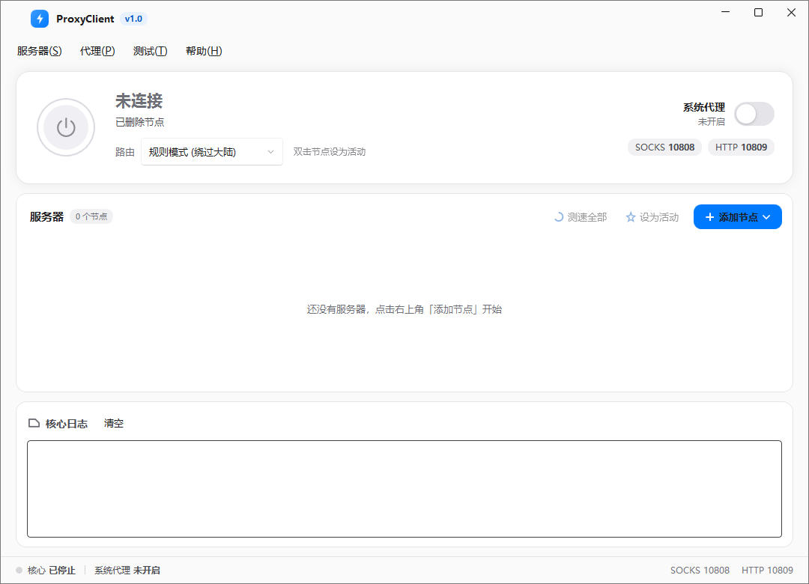

# ProxyClient

一个基于 Xray-core 的轻量 Windows 代理客户端，采用现代化深色 WPF 界面。



## 功能特性

- 支持协议：VMess / VLESS / Trojan / Shadowsocks
- 从分享链接批量添加节点
- 订阅导入与更新
- 规则模式 / 全局模式路由切换
- 系统代理一键开启/关闭
- 节点测速
- 托盘常驻，支持开机自启
- 启动后自动连接
- 启动时最小化 / 关闭按钮最小化到托盘

## 技术栈

- .NET 9
- WPF
- Windows Forms（托盘图标）
- Xray-core

## 本地运行

```bash
cd ProxyClient
dotnet run
```

## 目录说明

- `ProxyClient/`：WPF 客户端源码
- `xray-core/`：Xray-core 可执行文件与资源

## 本地端口

- SOCKS5：`127.0.0.1:10808`
- HTTP：`127.0.0.1:10809`

## 注意

- 本软件仅用于学习和技术研究，请遵守当地法律法规。
- 开机自启通过写入当前用户注册表 `HKCU\Software\Microsoft\Windows\CurrentVersion\Run` 实现。
